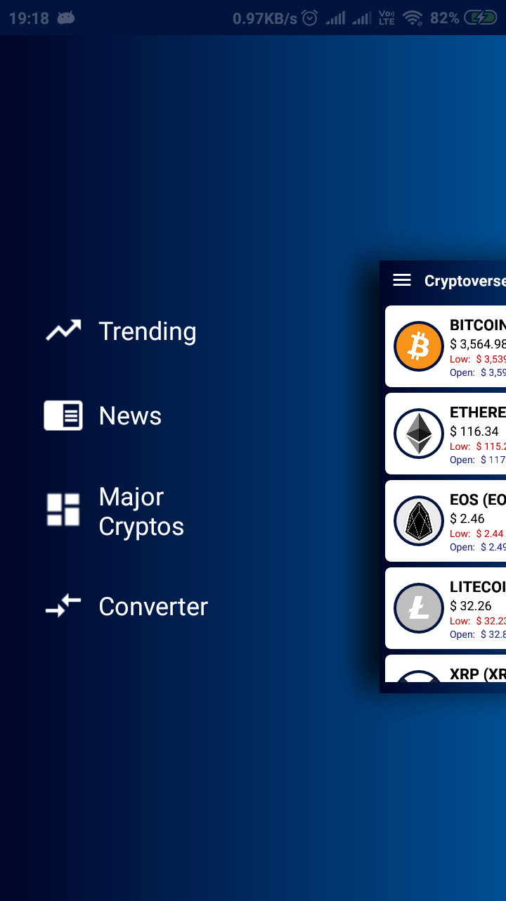
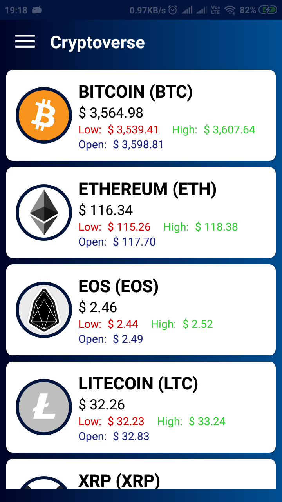
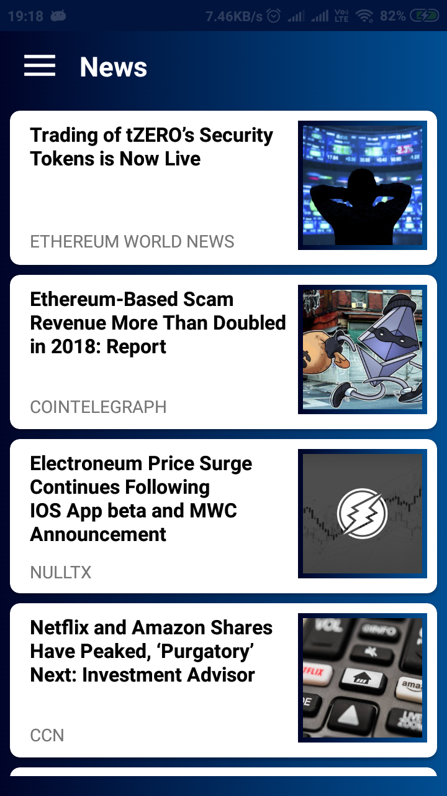
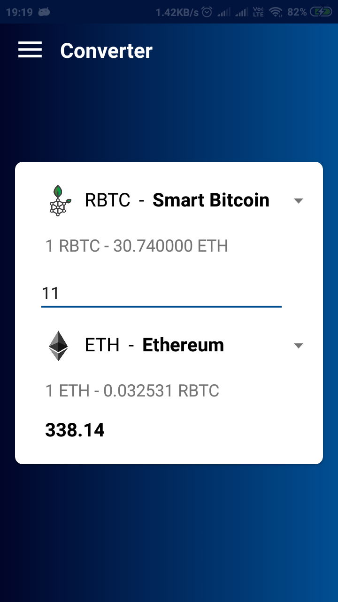

# Cryptoverse

An app for Cryptocurrency prices, trends, conversions and latest news. 

It uses the [CryptoCompare API](https://min-api.cryptocompare.com).

## Screenshots
<table>
    <tr>
        <td></td>
        <td></td>
        <td></td>
    </tr>
    <tr>
        <td></td>
        <td></td>
        <td></td>
    </tr>
</table>

## How to launch the project locally 
1. Download **[Android Studio](https://developer.android.com/studio/index.html)** from the Google Developers site or using this [link](https://developer.android.com/studio/index.html). 
2. Install the file to your pc. 
3. Download the required **SDK(Standard Development Kit) Tools** . 
4. **[Clone the repository](https://github.com/harshendrashah/Cryptoverse.git)** from : "https://github.com/harshendrashah/Cryptoverse.git" . 
    
   `bash 
    git clone --recursive https://github.com/harshendrashah/Cryptoverse.git 
    ` 
5. Open the project in Android Studio. 
6. For launching the project you can either : 
  1. **Install emulator** 
    * For this you must have **HAMX (Hardware Accelerated Execution Manager)** installed in Android Studio IDE. 
    * To install **[HAMX (Hardware Accelerated Execution Manager)](https://stackoverflow.com/questions/29136173/emulator-error-x86-emulation-currently-requires-hardware-acceleration)** refer here. 
    * You can download it at the time of installation of the Android Studio or install it afterwards in the **SDK manager**. 
    * Use your **AVD manager** for launching the app. 
  2. **Use your Android Phone** 
    * For using your phone, firstly connect your Android Phone with the pc using a data cable. 
    * Go to the Settings > Developers Setting. 
    * **Allow USB debugging**. 
    * **Run** the project from the Android Studio IDE. 

    
## Contributing

Found a bug?? => Create an issue.